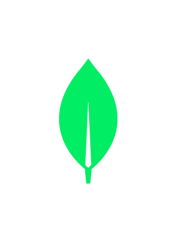

<h1 align="left" id="macropower-title">Mayur Prajapati</h1>
<h3 align="left">Versatilist, Passionately Curious & Keen Learner, loves solving problems & building projects</h3>

  
  
  
  

- :office: &nbsp;He is currently working at **[Briq]** as an Automation Engineer
- 💡&nbsp; He shone brightly as the **[spotlight of the month]** at Briq
<!-- - :seedling: &nbsp;Adding **DSA** and **Dynamic Programming** to his skills -->
<!-- - :books: &nbsp;Reading **Homo Sapiens**, **The Internet of Money** -->
- :speech_balloon: &nbsp;Likes to talk about **Life**, **Product Ideas** and **New Technology**
- :mailbox: &nbsp;Get in touch **[mayur@engineer.com](mailto:mayur@engineer.com)**
- :computer: &nbsp;Or connect on **[LinkedIn]**

 

<h2 align="left" id="articles">Articles he wrote</h2>
<a href="https://medium.com/@mayurengineer/efficiently-transfer-http-traffic-using-websockets-a-step-by-step-guide-3f2991b591f7">
  Efficiently Transfer HTTP Traffic using WebSockets: A Step-by-Step Guide (2023)
</a>
 
<a href="https://medium.com/flutter-community/how-to-animate-dialogs-in-flutter-here-is-answer-492ea3a7262f">
  How to animate dialogs in Flutter (2019)
</a>
 
<a href="https://www.instagram.com/sudocode.info/">Sudocode.info (Instagram)</a>
 

 

<h2 align="left" id="tech">Tools and Technologies he likes to work with</h2>

**Programming Languages**
<table>
  <tr>
    <td align="center" width="96">
      
       Java (Core)
    </td>
    <td align="center" width="96">
      
       Python
    </td>
    <td align="center" width="96">
      
       TypeScript
    </td>
    <td align="center" width="96">
      
       JavaScript
    </td>
    <td align="center" width="96">
      
       Kotlin
    </td>
    <td align="center" width="96">
        
       Dart
    </td>
  </tr>
</table>

**Libraries and Frameworks**
<table>
  <tr>
    <td align="center" width="96">
      
       Selenium Webdriver
    </td>
    <td align="center" width="96">
      
       VueJS
    </td>
    <td align="center" width="96">
      
       Flutter
    </td>
    <td align="center" width="96"> 
      
       Apache Commons
    </td>
    <td align="center" width="96">
      
       Android
    </td>
    <td align="center" width="96">
      
       NodeJS
    </td>
  </tr>
</table>

**Cloud**
<table>
  <tr>
    <td align="center" width="96">
      
       AWS
    </td>
  </tr>
</table>

**Databases**
<table>
  <tr>
    <td align="center" width="96">
      
       MongoDB
    </td>
  </tr>
</table>

**Tools**
<table>
  <tr>
    <td align="center" width="96">
      
       Ubuntu
    </td>
    <td align="center" width="96">
      
       Jenkins
    </td>
    <td align="center" width="96">
      
       Git SCM
    </td>
    <td align="center" width="96">
      
       GitLab
    </td>
    <td align="center" width="96">
      
       Eclipse IDE
    </td>
    <td align="center" width="96">
      
       VS Code
    </td>
    <td align="center" width="96">
      
       Gradle
    </td>
    <td align="center" width="96">
        
         Maven
      </td>
      <td align="center" width="96">
        
       Nginx
    </td>
    </tr>
</table>

<h2 align="center" id="stats">⚡ Stats ⚡</h2>
 

  

  
      
  

           
   
   

   
  

[Briq]: https://br.iq "Briq"
[linkedin]: https://www.linkedin.com/in/mayurengineer "Mayur Prajapati LinkedIn"
[spotlight of the month]: https://www.briq.com/blog/spotlight-mayur
