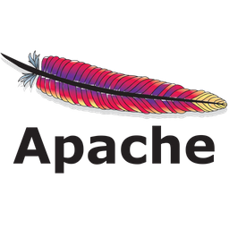

<h1 align="left" id="macropower-title">Mayur Prajapati</h1>
<h3 align="left">He is a Versatilist, Passionately Curious & Keen Learner dev, loves solving problems & building projects</h3>

  
  
  
  

- :office: &nbsp;He is currently working at **[Briq]** as an Automation Engineer
- :seedling: &nbsp;Adding **DSA** and **Dynamic Programming** to his skills
- :books: &nbsp;Reading **Homo Sapiens**, **The Internet of Money**
- :speech_balloon: &nbsp;Likes to talk about **Life**, **Product Ideas** and **New Technology**
- :mailbox: &nbsp;You can catch him on **[E-mail](mailto:mayur@engineer.com)**
- :computer: &nbsp;Or connect on **[LinkedIn]**

 

<h2 align="left" id="tech">Favorite Tech</h2>

> Tools, languages, and other things that he likes to work with.
<table>
  <tr>
    <td align="center" width="96">
      
       Java&nbsp;(Core)
    </td>
    <td align="center" width="96">
      
       Selenium Webdriver
    </td>
    <td align="center" width="96">
      
       Python
    </td>
    <td align="center" width="96">
      
       Jenkins
    </td>
    <td align="center" width="96">
      
       TypeScript
    </td>
    <td align="center" width="96">
      
       JavaScript
    </td>
    <td align="center" width="96">
      
       VueJS
    </td>
    <td align="center" width="96">
      
       Flutter
    </td>
    <td align="center" width="96">
      
       MongoDB
    </td>
  </tr>
  <tr>
    <td align="center" width="96"> 
      
       Apache Commons
    </td>
    <td align="center" width="96">
      
       Kotlin
    </td>
    <td align="center" width="96">
      
       Git SCM
    </td>
    <td align="center" width="96">
      
       GitLab
    </td>
    <td align="center" width="96">
      
       Eclipse IDE
    </td>
    <td align="center" width="96">
      
       Android
    </td>
    <td align="center" width="96">
      
       NodeJS
    </td>
    <td align="center" width="96">
      
       VS Code
    </td>
    <td align="center" width="96">
      
       Gradle
    </td>
    <tr>
      <td align="center" width="96">
        
         Maven
      </td>
    </tr>
</table>

[Briq]: https://br.iq "Briq"
[linkedin]: https://www.linkedin.com/in/mayurengineer "Mayur Prajapati LinkedIn"